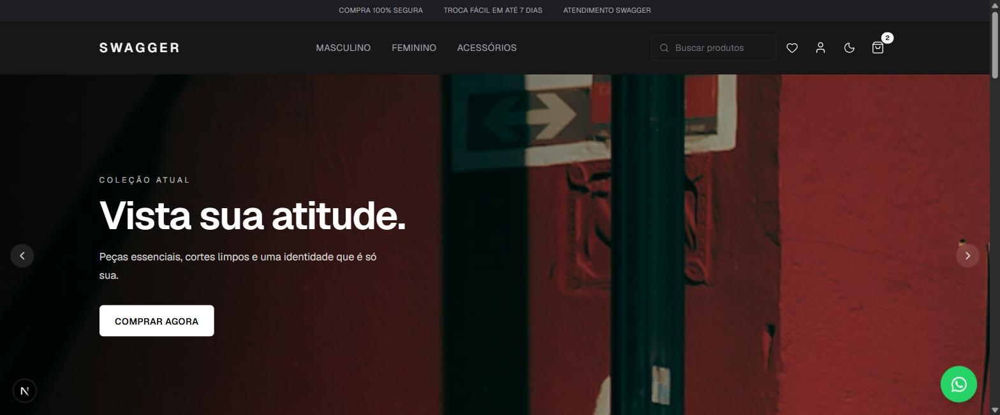
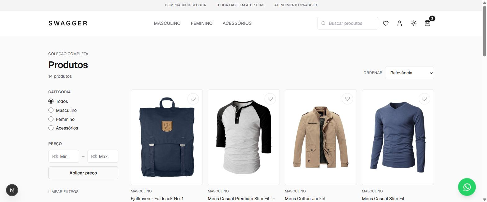
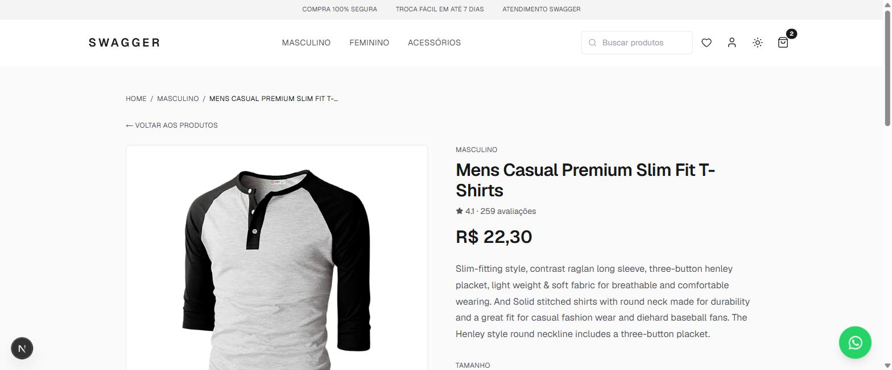

# SWAGGER — E-commerce de Moda

Loja de moda fictícia construída do zero com **Next.js 16 (App Router)**, com identidade visual própria, dark/light mode completo e experiência pensada como um e-commerce real — carrinho, favoritos, busca com autocomplete, filtros, seleção de tamanho, zoom nas fotos do produto e mais.

🔗 **Demo ao vivo:** https://guiisilva00.github.io/swagger/

   

---

## Screenshots

| Home (dark) | Listagem de produtos (light) | Página de produto |
|---|---|---|
|  |  |  |

---

## Sobre o projeto

O SWAGGER começou como um protótipo simples e foi evoluído em camadas — arquitetura, UX, design system e polimento — até chegar numa base próxima de um e-commerce de verdade, mesmo sem backend próprio (usa a [Fake Store API](https://fakestoreapi.com) como fonte de catálogo). O foco do projeto foi menos "fazer funcionar" e mais **como um produto de software real é construído**: decisões documentadas, bugs encontrados em QA manual e corrigidos, e uma arquitetura pensada para receber backend/autenticação/pagamento no futuro sem reescrever nada.

## Funcionalidades

**Vitrine**
- Home com hero em carrossel full-bleed (fotos reais, autoplay, setas, indicadores), barra de benefícios, categorias com foto, destaques e seção editorial
- Listagem de produtos com filtro por categoria e preço, busca por texto e ordenação
- Chips de filtro ativo removíveis, tudo refletido na URL (compartilhável, funciona com o botão voltar)
- Busca com autocomplete local no header (desktop e mobile)

**Produto**
- Breadcrumbs, avaliação, descrição
- **Zoom na foto** por hover (lupa) no desktop e lightbox fullscreen (com pinch-zoom nativo) no mobile/clique
- **Seleção de tamanho** para roupas (PP–GG), com o carrinho tratando produto + tamanho como itens distintos
- Seção "Você também pode gostar" (produtos relacionados de verdade, mesma categoria)
- Dados estruturados (JSON-LD) para SEO

**Carrinho & Favoritos**
- Carrinho persistente (localStorage), quantidade validada, preço unitário e total por linha
- Favoritos persistentes com contador em tempo real no header
- Preços formatados em Real (`R$ 1.299,90`) em toda a aplicação

**Tema**
- **Dark e Light mode** completos, com paleta de tokens centralizada (não é só inverter cores)
- Respeita a preferência do sistema operacional até o usuário escolher manualmente; a escolha fica salva

**Outros detalhes**
- Botão flutuante do WhatsApp
- Página 404 e de erro com a identidade visual do site
- Acessibilidade: navegação por teclado, `aria-label`, foco visível, drawers/modais acessíveis, carrossel respeita `prefers-reduced-motion`

## Como usar o site

1. Acesse a [demo](https://guiisilva00.github.io/swagger/) e navegue pela Home, ou vá direto em **Produtos** no menu
2. Filtre por categoria/preço ou use a busca no topo (tem autocomplete)
3. Abra um produto, escolha o tamanho (quando aplicável) e adicione ao carrinho — clique na foto para ampliar
4. Favorite produtos clicando no coração; veja tudo em **Favoritos**
5. Alterne entre claro/escuro no ícone de sol/lua no header

> Checkout, login e cadastro são **prévias de interface** — não há backend conectado, então nada é enviado ou salvo além do que já fica no seu navegador (carrinho, favoritos e tema).

## Stack técnica

- **Framework:** Next.js 16 (App Router), export estático (`output: "export"`)
- **Linguagem:** JavaScript (sem TypeScript)
- **Estilização:** Tailwind CSS v4 (design system via tokens CSS, sem `tailwind.config`)
- **Tema:** [next-themes](https://github.com/pacocoursey/next-themes)
- **Ícones:** [lucide-react](https://lucide.dev)
- **Estado:** React Context + `useReducer` (carrinho e favoritos), persistidos em `localStorage`
- **Dados:** snapshot local do catálogo da Fake Store API (`src/data/products.json`)
- **Deploy:** GitHub Actions → GitHub Pages

## Rodando localmente

```bash
npm install
npm run dev
```

Abra [http://localhost:3000](http://localhost:3000).

```bash
npm run build   # gera o export estático em out/
npm run lint
```

## Deploy

O workflow em `.github/workflows/deploy.yml` builda e publica no GitHub Pages a cada push em `main`. O catálogo vem de um snapshot local (`src/data/products.json`) em vez de buscar a Fake Store API em tempo de build, já que os runners do GitHub Actions costumam ser bloqueados (403) por ela — isso também torna o build determinístico.

## Créditos das imagens

Fotos de moda (hero, categorias, seção editorial) do [Pexels](https://www.pexels.com), licença gratuita para uso comercial. Créditos completos em `IMAGE_SOURCES.md`.
